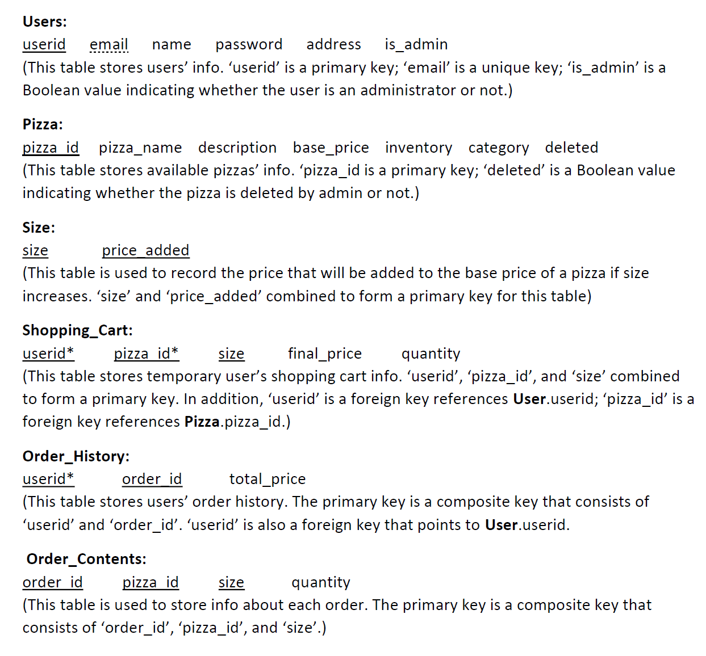

**Author:** Daniel H. Xiang, Shaoke Li, John Scalley

**Project Name:** Online Pizza Shop

**Description:** An online pizza shop where you can find your favorite pizza and have it delivered to your place! User can sign up free for an account to order online.

**Version:** 0.0.1

**Date:** 09-12-2020

**Info:** 
- Backend: PHP; Frontend: JavaScript; Database: MySQL
- Table schema:

**Instructions:**
1. Install MAMP
2. Put all source code in MAMP's `htdocs` folder
3. Go to localhost:8888/project/home.html
4. My port number for database is 3306. Change your port number in all php files if yours is different.
